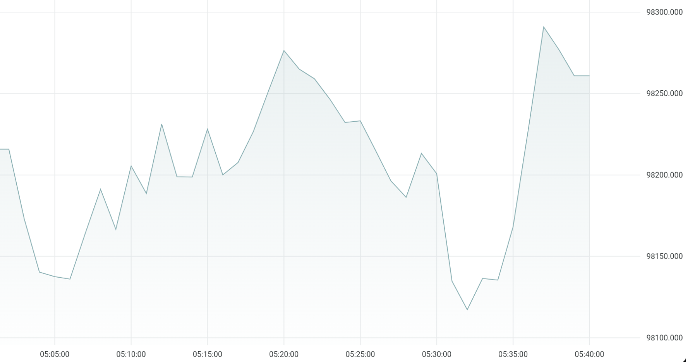
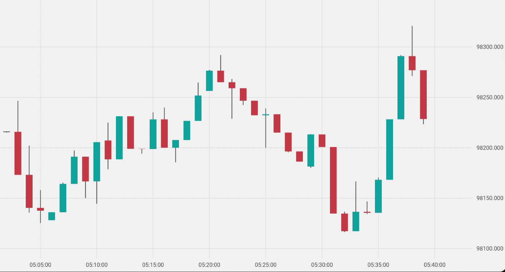
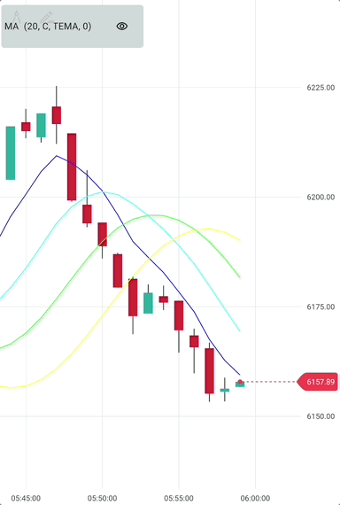

# Chart Types

The Deriv Chart library supports various chart types for visualizing financial data. This guide explains each chart type, its use cases, and how to implement it.

## Overview

The chart type is determined by the `mainSeries` parameter passed to the `Chart` widget. Each chart type is represented by a different series class:

- `LineSeries` - Line chart
- `CandleSeries` - Candlestick chart
- `OHLCSeries` - OHLC (Open-High-Low-Close) chart
- `HollowCandleSeries` - Hollow candlestick chart

## Line Chart

Line charts connect data points with straight lines, showing the price movement over time. They are useful for visualizing trends and are often used for tick data or when a simpler visualization is preferred.

### Implementation

```dart
Chart(
  mainSeries: LineSeries(ticks),
  pipSize: 2,
  granularity: 60000, // 60000 milliseconds (1 minute) interval
)
```

### Data Requirements

Line charts require a list of `Tick` objects, each containing an `epoch` (timestamp) and a `quote` (price).

```dart
final ticks = [
  Tick(epoch: DateTime.now().subtract(const Duration(minutes: 5)), quote: 100),
  Tick(epoch: DateTime.now().subtract(const Duration(minutes: 4)), quote: 120),
  // More ticks...
];
```

### Customization

You can customize the appearance of the line chart using the `LineStyle` class:

```dart
Chart(
  mainSeries: LineSeries(
    ticks,
    style: LineStyle(
      color: Colors.blue,
      thickness: 2,
      isDashed: false,
    ),
  ),
  pipSize: 2,
)
```

### Example



## Candlestick Chart

Candlestick charts display price movements using "candles" that show the open, high, low, and close prices. They are widely used in financial analysis as they provide a comprehensive view of price action.

### Implementation

```dart
Chart(
  mainSeries: CandleSeries(candles),
  pipSize: 2,
  granularity: 60000, // 60000 milliseconds (1 minute) interval per candle
)
```

### Data Requirements

Candlestick charts require a list of `Candle` objects, each containing an `epoch` (timestamp), `open`, `high`, `low`, and `close` prices.

```dart
final candles = [
  Candle(
    epoch: DateTime.now().subtract(const Duration(minutes: 5)),
    open: 100,
    high: 120,
    low: 95,
    close: 110,
  ),
  // More candles...
];
```

### Customization

You can customize the appearance of the candlestick chart using the `CandleStyle` class:

```dart
Chart(
  mainSeries: CandleSeries(
    candles,
    style: CandleStyle(
      positiveColor: Colors.green,
      negativeColor: Colors.red,
      wickWidth: 1,
      bodyWidth: 8,
    ),
  ),
  pipSize: 2,
  granularity: 60000, // 60000 milliseconds (1 minute) interval
)
```

### Example



## OHLC Chart

OHLC (Open-High-Low-Close) charts display price movements using horizontal lines to represent the open and close prices, with vertical lines showing the high and low prices. They provide the same information as candlestick charts but in a different visual format.

### Implementation

```dart
Chart(
  mainSeries: OHLCSeries(candles),
  pipSize: 2,
  granularity: 60000, // 60000 milliseconds (1 minute) interval per candle
)
```

### Data Requirements

OHLC charts use the same `Candle` objects as candlestick charts.

### Customization

You can customize the appearance of the OHLC chart using the `OHLCStyle` class:

```dart
Chart(
  mainSeries: OHLCSeries(
    candles,
    style: OHLCStyle(
      positiveColor: Colors.green,
      negativeColor: Colors.red,
      thickness: 1,
      width: 8,
    ),
  ),
  pipSize: 2,
  granularity: 60000, // 60000 milliseconds (1 minute) interval
)
```

## Hollow Candlestick Chart

Hollow candlestick charts are a variation of standard candlestick charts where bullish candles (close > open) are hollow and bearish candles (close < open) are filled. This can make it easier to distinguish between bullish and bearish price movements.

### Implementation

```dart
Chart(
  mainSeries: HollowCandleSeries(candles),
  pipSize: 2,
  granularity: 60000, // 60000 milliseconds (1 minute) interval per candle
)
```

### Data Requirements

Hollow candlestick charts use the same `Candle` objects as standard candlestick charts.

### Customization

You can customize the appearance of the hollow candlestick chart using the `HollowCandleStyle` class:

```dart
Chart(
  mainSeries: HollowCandleSeries(
    candles,
    style: HollowCandleStyle(
      positiveColor: Colors.green,
      negativeColor: Colors.red,
      wickWidth: 1,
      bodyWidth: 8,
      hollowPositiveColor: Colors.white,
    ),
  ),
  pipSize: 2,
  granularity: 60000, // 60000 milliseconds (1 minute) interval
)
```

## Switching Between Chart Types

You can dynamically switch between chart types by updating the `mainSeries` parameter:

```dart
class ChartTypeSwitcherExample extends StatefulWidget {
  const ChartTypeSwitcherExample({Key? key}) : super(key: key);

  @override
  State<ChartTypeSwitcherExample> createState() => _ChartTypeSwitcherExampleState();
}

class _ChartTypeSwitcherExampleState extends State<ChartTypeSwitcherExample> {
  ChartType _chartType = ChartType.candle;
  final List<Candle> _candles = [/* Your candle data */];
  final List<Tick> _ticks = [/* Your tick data */];

  @override
  Widget build(BuildContext context) {
    return Column(
      children: [
        Row(
          mainAxisAlignment: MainAxisAlignment.center,
          children: [
            Radio<ChartType>(
              value: ChartType.line,
              groupValue: _chartType,
              onChanged: (value) => setState(() => _chartType = value!),
            ),
            const Text('Line'),
            Radio<ChartType>(
              value: ChartType.candle,
              groupValue: _chartType,
              onChanged: (value) => setState(() => _chartType = value!),
            ),
            const Text('Candle'),
            Radio<ChartType>(
              value: ChartType.ohlc,
              groupValue: _chartType,
              onChanged: (value) => setState(() => _chartType = value!),
            ),
            const Text('OHLC'),
            Radio<ChartType>(
              value: ChartType.hollowCandle,
              groupValue: _chartType,
              onChanged: (value) => setState(() => _chartType = value!),
            ),
            const Text('Hollow Candle'),
          ],
        ),
        Expanded(
          child: Chart(
            mainSeries: _getMainSeries(),
            pipSize: 2,
            granularity: 60000, // 60000 milliseconds (1 minute) interval
          ),
        ),
      ],
    );
  }

  Series _getMainSeries() {
    switch (_chartType) {
      case ChartType.line:
        return LineSeries(_ticks);
      case ChartType.candle:
        return CandleSeries(_candles);
      case ChartType.ohlc:
        return OHLCSeries(_candles);
      case ChartType.hollowCandle:
        return HollowCandleSeries(_candles);
    }
  }
}

enum ChartType { line, candle, ohlc, hollowCandle }
```

### Example



## Next Steps

Now that you understand the different chart types available in the Deriv Chart library, you can explore:

- [Configuration](configuration.md) - Learn about more configuration options
- [Indicators](../features/indicators/overview.md) - Add technical indicators to your charts
- [Drawing Tools](../features/drawing_tools/overview.md) - Enable interactive drawing tools