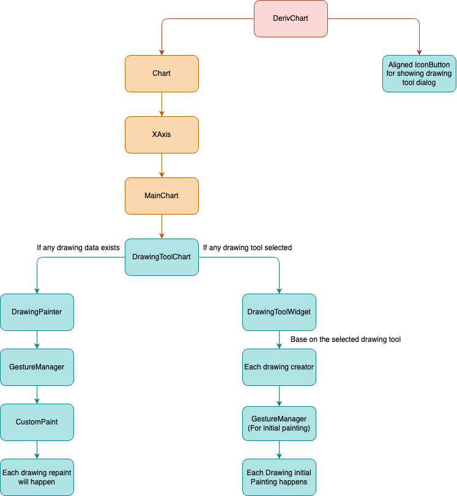

# Drawing Tools

The process initiates by opening the drawing tools dialog and selecting a preferred drawing tool. Subsequently, the user can add specific taps on the Deriv chart to start drawing with default configurations.

The GestureDetector on the Deriv chart, used by the 'drawing_creator' captures the user's input. By invoking the `onAddDrawing` callback within the onTap method, the drawing will be painted on the chart.

Any modifications or adjustments to the drawing can be made by the user through the drawing tools dialog, triggering an update in the drawing configuration.

To enable the drawings to be draggable, a distinct gesture is assigned to each drawing added to the chart. This gesture, embedded within the DrawingPainter, identifies any user taps on the drawing and designates the drawing as selected or deselected. The user can then drag the selected drawing across the chart.

To update the position of the dragged drawing, the drawing must be repainted on the chart. This operation is performed by the CustomPaint component within the DrawingPainter.

The drawing data is retrieved based on the chart's symbol, and this data is stored in the shared preferences under the chart's symbol key.

# Drawing Tool Chart

A widget named DrawingToolChart is embedded within MainChart, enabling users to sketch particular shapes on DerivChart. This feature comprises two main parts: DrawingToolWidget and DrawingPainter. The DrawingPainter is specifically tasked with painting and repainting the drawings and is invoked for every drawing added to the chart.

## DrawingToolWidget

It assigns the task of drawing creation to the respective drawing tool creator. Each creator employs the chart's gestures to detect user inputs and initially adds the drawing to the list by invoking the onAddDrawing callback. Every drawing tool creator extends from the DrawingCreator class.

## DrawingCreator

It is a base class for all drawing tool creators. It is responsible for adding the drawing to the list and invoking the onAddDrawing callback. It also provides the drawing tool creator with the chart's gestures to detect user inputs.

## DrawingPainter

A stateful widget which is responsible for painting and repainting the drawings based on theirs configs using `CustomPaint`. Since the CustomPaint is wrapped within GestureDetector, each drawing created possesses its dedicated gesture, designed specifically for enabling the drawings to be draggable.

In this widget we make drawings selectable by means of gesture and `hitTest` of `CustomPainter`. `hitTest` method checks if the user has clicked on a drawing or not, if yes it will return true. Inside `CustomPaint` we are calling `onPaint` and `hitTest` for each drawingPart.

