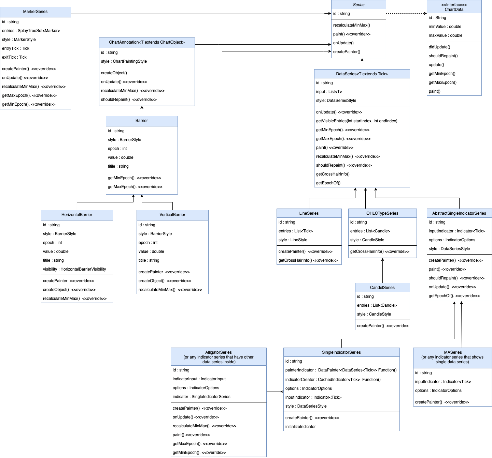

# Market data
The market data(input data of chart) is a list of *Ticks* or *OHLC*.
- A **Tick** data each element has two properties, epoch (time-stamp) and quote (price).
- An **OHLC** (candle) data each element has five properties, epoch (time-stamp) and open, close, high, low prices value.

# Chart Scheme
Chart widget is a Canvas that we paint all data of chart inside this Canvas.

this canvas has  X-Axis and Y-Axis coordinate.

# X-Axis
X-Axis coordination system works with *rightBoundEpoch* and *msPerPx* variables.
1. **rightBoundEpoch**: The time-stamp of the chart screen right edge.
   we initially set it to point to `maxRightBoundEpoch`, The last Tick/OHLC epoch on closed markets or current time on open markets, plus a constant offset.

2. **msPerPx**: which specifies each pixel of the chart screen horizontally consists of how many milliseconds.

3. **leftBoundEpoch**:The time-stamp of the chart screen left edge.
By knowing **msPerPx**(chart's width in pixels) and **rightBoundEpoch**, We can then calculate the **leftBoundEpoch** like this:
**leftBoundEpoch = rightBoundEpoch - screenWidth * msPerPx**
 Also we can find out which data is inside this range and gonna visible.

# Y-Axis
For Y-Axis coordination we would need to have min and max quote values that are in the visible area of chart.
1. **topBoundEpoch**:The maximum quote(price) of the data between *rightBoundEpoch* and *leftBoundEpoch*.

2. **bottomBoundEpoch**:The minimum quote(price) of the data between *rightBoundEpoch* and *leftBoundEpoch*.

 **now we can have the two conversion functions which can give us (x, y) positions inside the chart canvas for any epoch and quote values.**

# X-Axis labels
- **gridTimestamps** calculates the  X-Axis labels. it Creates a list of [DateTime] between rightBoundEpoch and leftBoundEpoch with gaps of [timeGridInterval].
- **timeGridInterval** is calculating by function with same name. it Returns the first time interval which has the enough distance between lines.

# Y-Axis labels
**YAxisModel** is a Model for calculating the grid intervals and quotes(labels).
by knowing the **topBoundQuote** and **bottomBoundQuote** we calculate the labels based on interval. this intervals calculates by **quoteGridInterval**.
- **quoteGridInterval** Calculates the grid interval of a quote by getting the [quotePerPx] value.
- **quotePerPx** Calculates the quotes that can be placed per pixel by division of distance between topBound and bottomBound in quote and pixel.

`minDistanceBetweenLines` determines the minimum distance that we want two Y-Axis labels have.
`intervals` is a static list of doubles that shows Options for quote labels value distance in Y-Axis.
One of these intervals will be selected to be the distance between Y-Axis labels.
the number from `intervals` list select as a interval that using it with given [quotePerPx] give us distance more than `minDistanceBetweenLines`.

# X-Axis scrolling
Scrolling in the chart happens by updating **rightBoundEpoch** of the chart's X-Axis.
by changing the **rightBoundEpoch** amount, will make the chart’s scroll position be on the last tick when we first load the chart.

# Zooming
Scrolling in the chart happens by updating **msPerPx**.
**msPerPx** is for changing the zoom level of the chart, increasing it will result in zoom-out and decreasing to zoom-in.

# Painting data

## Data classes

we have abstract class named **ChartData** that represent data that the chart takes and makes it paint its self on the chart's canvas including: *Line*, *Candle* data, *Markers*, *barriers* etc..
**ChartData** has a `paint` method that Paints this [ChartData] on the given [canvas].

**DataSeries** is a Super class of any data series that has one list of sorted data to paint (by epoch).
  **LineSeries**, **CandleSeries**, **OHLCSeries**, indicator series like **MASeries**(for moving average), **RSISeries**, are all subclasses of DataSeries directly or not.
 To share common functionality of painting **ChartData** we have class **DataSeries**.

**Series** is Base class of all chart series painting.

## Pinter classes

**SeriesPainter** is a abstarct class responsible to paint its [series] data.

We have a abstract class named **DataPainter** that is extends from **SeriesPainter**  and it is a class to paint common option of [DataSeries] data.

Other painters like **LinePainter**( A [DataPainter] for painting line data), **CandlePainter**(A [DataPainter] for painting CandleStick data) and **ScatterPainter**, are all extends from **DataPainter**.

**DataPainter** has a method called `onPaint` that calls `onPaintData`. actually paints happens in `onPaintData` that is override by each painter. for example **LinePainter** paints line in `onPaintData` method and **CandlePainter** paints Candles and `onPaintData` method. `onPaint` is be a place where **DataPainters**  need to do some common things before do their painting.

# Update chart data
when the list of data changes(by scrolling, zooming, or receiving new data) we need to update the chart.
There is 3 steps that the chart requires to do when these variables change in order to update its components(including mainSeries, indicators, Barrier, markers, ... ).

1. The chart goes through its components and notifies them about the change. Each of these components then update their visible data inside the new (leftEpoch, rightEpoch) range.
 Then they can determine what are their min/max value (quote/price).

2. The chart then asks from every components their min/max values through their `minValue` and `maxValue` getters to calculate the overall min/max of its Y-Axis range.
 Any component that is not willing to be included in defining the Y-Axis range can return `double.NaN` values as its  min/max.
  then if this component had any element outside of the chart's Y-Axis range that element will be invisible.

3. The conversion functions always return the converted x, y values based on the updated variables (Left/right bound epoch, min/max quote, top/bottom padding).
 The chart will pass these conversion functions along with a reference to its canvas and some other variables to ChartData class to paint their visible data.

