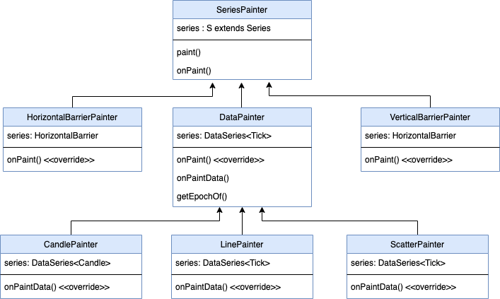

# Market data
The market data(input data of chart) is a list of *Ticks* or *OHLC*.
- A **Tick** data each element has two properties, epoch (time-stamp) and quote (price).
- An **OHLC** (candle) data each element has five properties, epoch (time-stamp) and open, close, high, low prices value.

# Chart Scheme
Chart widget is a Canvas that we paint all data of chart inside this Canvas.

this canvas has  X-Axis and Y-Axis coordinate.

# X-Axis
X-Axis coordination system works with *rightBoundEpoch* and *msPerPx* variables.
1. **rightBoundEpoch**: The time-stamp of the chart screen right edge.
   we initially set it to point to `maxRightBoundEpoch`, The last Tick/OHLC epoch on closed markets or current time on open markets, plus a constant offset.

2. **msPerPx**: which specifies each pixel of the chart screen horizontally consists of how many milliseconds.

3. **leftBoundEpoch**:The time-stamp of the chart screen left edge.
By knowing **msPerPx**(chart's width in pixels) and **rightBoundEpoch**, We can then calculate the **leftBoundEpoch** like this:
**leftBoundEpoch = rightBoundEpoch - screenWidth * msPerPx**
 Also we can find out which data is inside this range and gonna visible.

# Y-Axis
For Y-Axis coordination we would need to have min and max quote values that are in the visible area of chart.
1. **topBoundEpoch**:The maximum quote(price) of the data between *rightBoundEpoch* and *leftBoundEpoch*.

2. **bottomBoundEpoch**:The minimum quote(price) of the data between *rightBoundEpoch* and *leftBoundEpoch*.

 **now we can have the two conversion functions which can give us (x, y) positions inside the chart canvas for any epoch and quote values.**

# X-Axis labels
- **gridTimestamps** calculates the  X-Axis labels. it Creates a list of [DateTime] between rightBoundEpoch and leftBoundEpoch with gaps of [timeGridInterval].
- **timeGridInterval** is calculating by function with same name. it Returns the first time interval which has the enough distance between lines.

# Y-Axis labels
**YAxisModel** is a Model for calculating the grid intervals and quotes(labels).
by knowing the **topBoundQuote** and **bottomBoundQuote** we calculate the labels based on interval. this intervals calculates by **quoteGridInterval**.
- **quoteGridInterval** Calculates the grid interval of a quote by getting the [quotePerPx] value.
- **quotePerPx** Calculates the quotes that can be placed per pixel by division of distance between topBound and bottomBound in quote and pixel.

`minDistanceBetweenLines` determines the minimum distance that we want two Y-Axis labels have.
`intervals` is a static list of doubles that shows Options for quote labels value distance in Y-Axis.
One of these intervals will be selected to be the distance between Y-Axis labels.
the number from `intervals` list select as a interval that using it with given [quotePerPx] give us distance more than `minDistanceBetweenLines`.

# X-Axis scrolling
Scrolling in the chart happens by updating **rightBoundEpoch** of the chart's X-Axis.
by changing the **rightBoundEpoch** amount, will make the chart’s scroll position be on the last tick when we first load the chart.

# Zooming
Scrolling in the chart happens by updating **msPerPx**.
**msPerPx** is for changing the zoom level of the chart, increasing it will result in zoom-out and decreasing to zoom-in.

# *Painting data*

## Data classes

we have abstract class named **ChartData** that represent data that the chart takes and makes it paint its self on the chart's canvas including: *Line*, *Candle* data, *Markers*, *barriers* etc..
A **ChartData** can be anything that shows some data on the chart. The chart can take a bunch of ChartData objects and for these objects the chart goes through some steps until they finally get painted on it's canvas:

Notify them about the x-axis visible range via calling update() method
getting each ChartData's min/max values after they have updated their visible data and value range.
Defining y-axis min/max value after knowing all the chart data's value ranges.
Calling paint() method on every ChartData to paint them on the canvas.

**DataSeries** is a Super class of any data series that has ***one*** list of sorted data to paint (by epoch).
  **LineSeries**, **CandleSeries**, **OHLCSeries**,AbstractSingleIndicatorSeries(all indicator series that shows only one sequential data like **MASeries**(for moving average), **RSISeries** are extends from it) are all subclasses of DataSeries directly or not.
 To share common functionality of painting **ChartData** we have class **DataSeries**.

**Series** is Base class of all chart series painting.
The series that have ***more than one*** list of sorted data to paint (like AlligatorIndicatorSeries) are extends from **Series** and have some SingleIndicatorSeries inside.

### ChartObject
Any component other than chart data (line or candle) which can take a rectangle on the chart's canvas.
it has `isOnEpochRange` and `isOnValueRange` method that shows Whether this chart object is in chart horizontal or vetical visible area or not.

### BarrierObject
A **ChartObject** for defining position of a horizontal or vertical barrier.

### Chart annotations
annotations are the shapes without any data sequence that added to chart, like **Barriers**.
**ChartAnnotation** is a Base class of chart annotations that extends from **Series**.

### Barriers
**Barrier** is a base class of barrier. it has title, epoch and value.
we have two kind of barriesrs: **VerticalBarrier** and **HorizontalBarrier**.
**VerticalBarrier**: is a verical line in the chart that draws on specificate time stamp. it's exetends from **Barrier** class.
**HorizontalBarrier**: is a horizental line that draws on specificate value(price).

**TickIndicator** is a subclass of **HorizontalBarrier** to show the current tick lable and horizental line. it has its own default configuration like **HorizontalBarrierVisibility** type.
The reason that we have **TickIndicator** is to recognizing the diffrence between **HorizontalBarrier** and **TickIndicator** if the user did not define the id for them.

To add horizontal/vertical barriers, specify them in the `annotations` parameter of the chart.
they have `createPainter` object to paint the **BarrierObject** that creats in their `createObject` method.

### Markers
**MarkerSeries** extends from **Series** to show the markers that added to chart.

# Pinter classes

**SeriesPainter** is a abstarct class responsible to paint its [series] data.

We have a abstract class named **DataPainter** that is extends from **SeriesPainter**  and it is a class to paint common option of [DataSeries] data.

Other painters like **LinePainter**( A [DataPainter] for painting line data), **CandlePainter**(A [DataPainter] for painting CandleStick data) and **ScatterPainter**, are all extends from **DataPainter**.

**DataPainter** has a method called `onPaint` that calls `onPaintData`. actually paints happens in `onPaintData` that is override by each painter. for example **LinePainter** paints line in `onPaintData` method and **CandlePainter** paints Candles and `onPaintData` method. `onPaint` is be a place where **DataPainters**  need to do some common things before do their painting.

for painting Barriers that they don't have `DataSeries`, we have **VerticalBarrierPainter** and **HorizontalBarrierPainter** extends from **SeriesPainter**.
They override `onPaint` method to draw Vertical/Horizontal Barrier.

We have a `StatefulWidget` named **MarkerArea** to draw markers inside it.
**MarkerArea** is a Layer with markers.
For painting markers we have a **MarkerPainter** class extends from `CustomPainter`.

***The data that are in Visible area between **rightBoundEpoch**, **leftBoundEpoch**, **topBoundEpoch**, **bottomBoundEpoch** will painting by these methods.***

# Cross-hair
We have a `StatefulWidget` **CrosshairArea** that place this area on top of the chart to display candle/point details on longpress.
It contains three other StatelessWidgets named **CrosshairDetails** (The details to show on a crasshair) and **CrosshairLinePainter** (A custom painter to paint the crossshair `line`) and **CrosshairDotPainter** (A custom painter to paint the crossshair `dot`).

When `onLongPressStart` is starts, `onCrosshairAppeared` Called to show candle/point details then we stop auto-panning to make it easier to select candle or tick, and show the longpress point details on chart.
also we start a timer to tarck the user scrolling speed.
In `updatePanSpeed` method, we update the pan speed and scroll when crosshair point closes to edages. In normal cases, when crosshair point not clos to edages, in `onLongPressStart` we make pan speed 0 to avoid scrolling, but when user getting close to edgs we need to scroll chart, so, `updatePanSpeed` will help us.

In `onLongPressUpdate` we call `updatePanSpeed`, then we calculate how much time passed between `onLongPressStart` and `onLongPressUpdate`, and calculate the animation speed based on this time(using VelocityTracker), then we animate with that speed between two diffreent point that user scroll to show the crossHair.

In `onLongPressEnd`, `onCrosshairDisappeare` Called when canlde or point is dismissed and auto-panning starts again and [crosshairTick] will clear.

# Theme
Chart has its own default dark and light themes that switch depending on Theme.of(context).brightness value. If user supply his/her own theme, he/she would have to handle switching him/herself.

`chart_theme` is the interface, `chart_default_theme` is a default implementation of the `chart_theme` which is instantiated and used inside the `Chart` widget if no theme is passed from the app to the `Chart` widget.

`painting_styles` are some style classes which is used to specify how certain components of the chart should be styled. like `barrier_style` contains style parameters of barriers.

# Update chart data
when the list of data changes(by scrolling, zooming, or receiving new data) we need to update the chart.
There is 3 steps that the chart requires to do when these variables change in order to update its components(including mainSeries, indicators, Barrier, markers, ... ).

1. The chart goes through its components and notifies them about the change. Each of these components then update their visible data inside the new (leftEpoch, rightEpoch) range.
 Then they can determine what are their min/max value (quote/price).

2. The chart then asks from every components their min/max values through their `minValue` and `maxValue` getters to calculate the overall min/max of its Y-Axis range.
 Any component that is not willing to be included in defining the Y-Axis range can return `double.NaN` values as its  min/max.
  then if this component had any element outside of the chart's Y-Axis range that element will be invisible.

3. The conversion functions always return the converted x, y values based on the updated variables (Left/right bound epoch, min/max quote, top/bottom padding).
 The chart will pass these conversion functions along with a reference to its canvas and some other variables to ChartData class to paint their visible data.

# BasicChart
**BasicChart** is an StatefulWidget that other charts extend from.

# MainChart
**MainChart** extends from **BasicChart** that is a main chart to display in the chart widget.

# BottomChart
Sometimes we need to show two chart in the screen, for example for showing bottom indicators, in that case, we use **BottomChart** that is extends from **BasicChart** to show secound chart widget.

# Chart
**Chart** is an interactive chart widget that is contain **MainChart** and **BottomChart**.
both **MainChart** and **BottomChart** are using same **XAxis** but they have different YAxis.

# DerivChart
**DerivChart** is a wrapper around the **Chart** which handles adding indicators to the chart.

*if you want to have indicators in chart, you should use ***DerivChart** insteaad of **Chart****

# Widgets
## Market Selector Widget
The widget that we have included it in the chart project to be accessable inside any other project which is going to use the chart, because this widget is supposed to show the asset (symbols) list to be shown by the chart.

## AnimatedPopupDialog
AnimatedPopupDialog is just a warrper widget to warpe around anything we want to show as a dialog.

## CustomDraggableSheet
CustomDraggableSheet is a wrapper widget  to be used combined with bottom sheet that makes to give the widget inbside the bottom sheet the behavior that we want.

