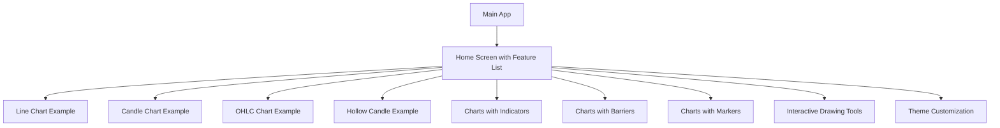

# Plan for Implementing the Sample App

Based on my analysis of the project structure and requirements, I'll create a comprehensive sample app that showcases different features of the chart package while also supporting automation and visual testing. Here's my proposed plan:

## 1. Project Structure

I'll create a new sample app within the existing repository. As you suggested, we can either:
- Create a new Dart file with a main function in the existing example folder
- Create a new folder like `example_v2` with its own structure

I recommend creating a new folder called `example_showcase` within the repository to keep the code organized while maintaining the existing example app. This approach allows us to:
- Keep the original example for reference
- Create a more structured showcase app
- Maintain clear separation between the two examples

## 2. Sample App Architecture

## 3. Key Components

### Main App
- Entry point with navigation setup
- Theme configuration
- Localization setup

### Feature List Screen
- Scrollable list of chart feature cards
- Each card will have:
  - Feature name
  - Brief description
  - Preview image/icon
  - Navigation to the detailed example

### Individual Feature Screens
Each feature screen will:
- Showcase a specific chart type or feature
- Include controls to modify parameters when applicable
- Have a consistent layout for testing purposes
- Include metadata for test identification

## 4. Testing Support

To facilitate automation and visual testing, I'll implement:

1. **Widget Keys**: Add semantic keys to important UI elements for easy identification during testing
2. **Test IDs**: Include test IDs in the widget tree for automation frameworks
3. **Golden Test Support**: Structure the examples to be easily captured for golden tests
4. **Consistent Layouts**: Ensure consistent layouts and sizes for reliable visual comparison
5. **Sample Data Provider**: Create a consistent data provider that can generate predictable chart data

## 5. Implementation Approach

1. Create the basic app structure with navigation
2. Implement the feature list screen
3. Create individual example screens for each chart type and feature
4. Add testing support elements
5. Document the testing approach

## 6. Sample Features to Showcase

1. **Basic Chart Types**
   - Line Chart
   - Candle Chart
   - OHLC Chart
   - Hollow Candle Chart

2. **Indicators**
   - Charts with overlay indicators (Bollinger Bands, Moving Averages)
   - Charts with bottom indicators (RSI, MACD)
   - Multiple indicators combination

3. **Interactive Elements**
   - Barriers (horizontal, vertical, combined)
   - Markers (entry/exit points)
   - Tick indicators

4. **Drawing Tools**
   - Line drawing tools
   - Trend lines
   - Fibonacci tools

5. **Customization**
   - Theme switching (light/dark)
   - Custom styling examples
